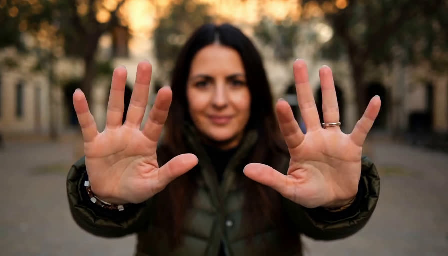
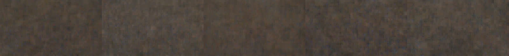

# ref2va with lightx2v's Turbo LoRA: what "melting" is, and what to run

Everything else in this repo is **t2va latency** for one customer. This file is a different
customer and a different question: **ref2va, quality *and* speed**, on
[`lightx2v/Minimax-h3-Turbo`](https://huggingface.co/lightx2v/Minimax-h3-Turbo) — and the report
that lightx2v's model **"很容易融化" (melts easily)**.

**Answered, 2026-09-17 — jump to [§6](#6-measured-2026-09-17-the-melting-is-one-flag-and-it-is-not-the-lora)
for the measurements.** The melting is `--lora-alpha 128` copied off lightx2v's README onto a ref2v
file whose metadata already declares alpha 8 over rank 128. Passing nothing gives a clean 8-step clip
that is *sharper* than the 50-step base model at **12.81 s** instead of 74.03 s; passing 128 gives
brown noise from frame 5. Sections 1–5 are the research pass that predicted this, kept as written.

Sections 1–5 were written before anything ran, off HF metadata, the safetensors headers (read with
HTTP `Range`, no 1.4 GB download), lightx2v's own inference script, and SGLang `main`. **Do not quote
a latency from §1–5 as measured** — those marked *extrapolated* are arithmetic on §4; §6 is the
measured set.

---

## 1. What "melting" means, and the three causes worth testing

**融化 / melting is not a term of art in the papers; it is what the community calls a subject
losing structural integrity while it moves.** Hands fuse into a blur, faces smear, edges dissolve
into the background, a second ghost of the subject appears. In lightx2v's own discussion threads,
about the **ref2v** LoRA specifically:

* #33 — *"This lora messes the hands, they become blurry. its bad… the quality is terrible for the
  overall ref2v video output"*, seconded: *"'blurs' hands for me as well, really just bad rendering
  of hands"*, and *"fast motion details like hair flowing in the wind lacks details"*.
* #13 — *"fight-scene outputs suffer from severe **artifacts, body distortion and blurring**"*.
* #44 — *"the current ref2v turbo model does not perform well in a 9:16 video aspect ratio, and is
  prone to **ghosting or overlapping images in the upper half of the screen**"*. Same reporter:
  *"The 16:9 aspect ratio seems normal."*
* #49 — *"To get the same video/audio quality with the R2V model I need at least 8 or 10 steps
  \[vs 4 for FL2V]. The quality difference is enormous. The R2V model needs to be retrained."*
* #51, on the newest 8-step 768p ref2v release — *"I'm not gonna lie, kinda disappointed with the
  result. Ref2v model really has quality issues as many claimed."*

So the customer's complaint is a real, widely reproduced property of **this LoRA family's ref2v
branch**, not a mistake on their side — and lightx2v agrees: their roadmap has exactly one item,
**"Improve the visual quality and consistency of Ref2VA and FL2VA Turbo."**

That said, three things make it much worse, and all three are on the operator's side:

### Cause 1 — the effective LoRA scale, and the documentation invites a 16x error

Every file in the repo is **rank 128, uniform, 624 tensors / 312 modules, BF16**. The scale that
matters is `alpha / rank`. It is **not the same across files**, and the metadata says so:

| file | `alpha` | effective scale |
|---|---:|---:|
| `fl2v_turbo_4step_v0.1` | *(absent)* | — |
| `fl2v_turbo_4step_v1.0_768p` | **128** | **1.0** |
| `fl2v_turbo_4step_v1.1_768p` | **128** | **1.0** |
| `fl2v_turbo_4step_v1.2_768p` | 8 | 0.0625 |
| `fl2v_turbo_8step_v1.0` (544p) | 8 | 0.0625 |
| `fl2v_turbo_8step_v1.0_768p` | 8 | 0.0625 |
| **`ref2v_turbo_4step_v0.1`** | **8** | **0.0625** |
| **`ref2v_turbo_8step_v1.0_768p`** | **8** | **0.0625** |

The `comfyui_*` conversions carry the same number as prose — `training_alpha: 8.0`,
`training_scale: 0.0625` — and the v1.0/v1.1 768p pair carry `training_alpha: 128.0`,
`training_scale: 1.0`. So the metadata is self-consistent per file: **lightx2v changed the training
scale at fl2v 4-step v1.2, and every ref2v file uses 0.0625.**

The trap: lightx2v's README publishes a 768p command line containing **`--lora-alpha 128`**, and
their script computes `effective_scale = lora_scale * lora_alpha / rank`. That flag is correct for
the two files it was written for and **16x too strong for everything else, including both ref2v
LoRAs**. A distill LoRA driven 16x past its training scale is exactly the failure the threads
describe as *"extremely over saturated plastic look"* (#27) and *"colors blow out"* (#9).

Two saving graces. ComfyUI reads `alpha` out of the file, so ComfyUI users at strength 1.0 are
already correct — which is why ComfyUI reports are milder than diffusers-script reports. And
**SGLang also reads it**: `_SAFETENSORS_ALPHA_KEYS = ("lora_alpha", "network_alpha", "alpha")` in
`runtime/pipelines_core/lora/peft_adapter.py`, gated on `_has_unambiguous_global_alpha`, which
these files satisfy (single rank 128, PEFT `.default.` slots). So on SGLang, `--lora-path` alone
applies 0.0625 with no flag — and **passing `--lora-alpha 128` to copy the README is the one thing
that would break it.**

### Cause 2 — 4 steps is not actually 4 steps

Community consensus in #30, from several people independently, on the *4-step* LoRAs:

> *"None of the existing or future 4-step LoRAs work properly at 4 steps. You need at least 6-8."*
> *"lowest I reach is 6 steps but 8 steps is the ideal to retain details."*

And for ref2v the gap is bigger (#49): ref2v needs **8-10** steps to reach what fl2v reaches at 4.
This is the single most important fact for a customer who wants quality *and* speed: **ref2va's
step budget is 2-2.5x fl2va's, not equal to it.** Budget 8 steps as the floor and price it that
way — see §4. The 8-step 768p ref2v v1.0 exists precisely because 4 was not enough.

### Cause 3 — the reference image is preprocessed by a different rule than the LoRA was trained on

lightx2v exposes `--reference-resize-mode` with three policies:

| policy | rule | upscales? |
|---|---|---|
| `match` (their default, **and what they trained with**) | `min(1, sqrt(target_area / ref_area))` | never |
| `max` | `min(1, 2048 / ref_short_edge)` | never |
| `diffusers` | `2048 / ref_short_edge`, forced | **yes** |

**SGLang implements the third one, hardcoded.**
`runtime/pipelines_core/stages/model_specific_stages/minimax_h3/reference_encoding.py:47` is
`MINIMAX_H3_REFERENCE_IMAGE_SHORT_EDGE = 2048`, and its docstring says *"independent 2048px
short-edge resize **with upscale enabled**, LANCZOS, nearest-32"*, `allow_upscale: True`. That is
MiniMax's own recipe for the base checkpoint, so it is right for base ref2va — and it is
**out of distribution for lightx2v's LoRA**, which never saw an upscaled reference.

This is the knob this repo already flagged as the biggest one in ref2va for a different reason —
cost. README's table stands: one 16:9 reference at 2048 is **7,296 rows**, at 1024 it is **1,824**,
and rows go as the square of the short edge. So this arm is worth running twice over: it is
simultaneously the largest latency lever and a live quality hypothesis, and the two point the same
way.

### Secondary, but cheap to get right

* **Shift.** For the ref2v 8-step 768p v1.0, lightx2v's own release post (#51) gives **video shift
  12, audio shift 3, Euler, up to 768p** — this is *not* in the model card's table, and it is *not*
  the 6/3 the 768p **fl2v** models want. SGLang's ref2va profile defaults to exactly 12.0 / 3.0
  (`task_profiles.py`), so the default is already right. Nothing to change; something to not break.
* **Audio shift.** #30 reports audio shift 4 causing languages to blend mid-sentence (Cantonese
  into Mandarin) and 6 fixing it. Worth knowing if the customer's output is dialogue-driven.
* **9:16.** #44's ghosting is aspect-ratio specific and 16:9 is reported clean. If the customer is
  producing vertical video, that alone may be the whole complaint.
* **Aspect/resolution range.** The documented ref2v 4-step v0.1 is 544p mixed-AR. 768p ref2v only
  exists as the 8-step v1.0. Running the v0.1 at 768p is out of distribution.

---

## 2. Which weights, which framework: ref2va does run on SGLang, but not on VDN

`RESULTS.md` records that this repo's fast server refuses ref2va, and the reason is a **training**
limit, not a framework one: `OpenVDN/vdn-minimax-h3` ships only the fl2va partition, so its own
error message points at the base model. Reading SGLang `main` confirms the base path is fully
implemented:

* `MiniMaxH3Pipeline.model_subfolder_for_variant` maps `ref2va -> "Ref2VA"`, `fl2va -> "FL2VA"`,
  `hybrid -> "Ref2VA"` (`runtime/pipelines/minimax_h3_pipeline.py:78-88`).
* The ref2va task profile accepts a keyframe plus **four** reference kinds —
  `role:"reference"` with `type` in `image` / `video` / `video_audio` / `audio` — routes video and
  video_audio into *both* tokenizers, and can derive `duration_seconds` from a reference audio
  probe (`task_profiles.py`).
* There is a dedicated `reference_encoding.py` stage: LANCZOS resize, the same seed-42 keyframe
  tokenizer recipe as fl2va, and for audio a deterministic VAE posterior **mean** (no sampling,
  cuDNN disabled for the encode).

So the customer's stack is **`MiniMaxAI/MiniMax-H3 --model-variant ref2va`** plus lightx2v's ref2v
LoRA. Two facts about that combination, both from source:

**Good news — SGLang already does the three key translations.** The concern that killed the fl2va
Turbo arm yesterday was that g7e's LoRA is *native*-named while the t2va tree is *diffusers*-named.
lightx2v's LoRAs are **diffusers**-named PEFT files (`transformer_blocks.N.attn.to_k.lora_A.default.weight`,
newer ones tagged `key_format: 'minimax-h3-diffusers'`), and SGLang's loader maps them itself:
`lora_param_names_mapping_fn` + `param_names_mapping_fn` for names and qkv fusion, and
`_swap_peft_swiglu_fc1_lora_b` for the SwiGLU half order
(`runtime/pipelines_core/lora/pipeline.py:56, 902-937`). lightx2v's ComfyUI conversion metadata
independently confirms both of those translations exist and in which direction —
`swi_glu_mapping: 'Diffusers [value;gate] -> ComfyUI [gate;value]'` and `qkv_fusion: 'block
diagonal B; concat A; alpha multiplied by 3'`.

**Bad news, already known — `--lora-path` does not survive `--quantization fp8`** on this build:
`AttributeError: 'RowParallelLinearWithLoRA' object has no attribute 'quant_method'`, aborting
server warmup (`scripts/sglang_base_arm.sh` records it verbatim). Three ways out, in order of
preference:

1. **Merge offline, then let SGLang quantize the merged bf16 tree.** `--model-variant hybrid`
   exists for exactly this and refuses to start without
   `--component-weights-paths.transformer`. And the merge is now *easy*, because
   `MiniMaxAI/MiniMax-H3` ships **both** layouts for ref2va — `Ref2VA/transformer` is native-named
   (`model.safetensors.index.json`) and **`transformer_ref/` is diffusers-named**
   (`diffusion_pytorch_model.safetensors.index.json`, 61.73 GiB). A diffusers LoRA into a diffusers
   tree needs **none** of the three translations. `scripts/lora_merge_h3.py` handles this case.
2. **bf16, no quantization.** Zero mapping work, correct alpha, but 61.73 GiB of bf16 DiT per rank
   under Ulysses plus 9.7 GiB video VAE will not fit an 80 GB card the way fp8 does (measured fp8
   peak was 62.1 GB *with* everything resident). Expect to need `--tp-size 2 --ulysses-degree 4`
   or FSDP. Fine for pictures, and **its latency is not comparable to any fp8 number in this repo.**
3. Wait for upstream to make the dynamic-LoRA wrapper quantization-aware. Smallest real fix; not
   ours.

---

## 3. What is *not* a lightx2v problem, and the community's workaround

Several reporters independently land on the same trick: **use the fl2v Turbo LoRA on the ref2va
model.** #49: *"I use the FL2V model for REF2VID… no matter if you use 2 or 8 input images"*;
#33: *"I had no idea the fl2v model works in the ref2v workflow. I tried it with the turbo LoRA,
results look much clearer"*; #13 runs `ref2va_int8` with the fl2v 4-step v0.1 and gets *"perfectly
fine dialogue-driven narrative"*, breaking only on fight scenes.

This is structurally possible for a reason visible in the metadata: **every** comfyui conversion,
*including both ref2v files*, declares `base_model: Comfy-Org/MiniMax-H3
minimax_h3_fl2va_bf16.safetensors`. The ref2va and fl2va DiTs have the same block structure — they
differ in the conditioning path, not in the modules a LoRA touches
(`to_q, to_k, to_v, to_out.0, ff.net.0.proj, ff.net.2` — note: **no** `adaln_proj`, unlike g7e's
adapter, so no adaln fix node is needed for these).

And lightx2v warns against it in as many words: *"Do not use an FL2VA LoRA checkpoint for this
command unless it was specifically trained for `transformer_ref`."* The counter-argument in #51 is
the one that matters to this customer: *"this new lora is much better at keeping the references,
even voice references are better"* — i.e. the fl2v LoRA buys **sharpness** and pays in **reference
fidelity**, which for a ref2va customer is the whole product. That trade is measurable, and it is
arm E below. Note also that the FL2V leaderboard being cited in that thread
(`multimodalart/h3-acceleration-arena`) contains **no ref2va entries at all**, so it says nothing
about this decision either way.

---

## 4. The speed budget, before anything is measured

Anchors, all measured on this box, fp8, 345 f (14.375 s at 24 fps), 8x H100:

| | s/step | rows |
|---|---:|---:|
| base H3, 480p | 0.98 | 43,759 |
| base H3, 768p | 3.73 | 105,265 |

Reference rows come *on top* and are attended densely both ways, at a measured **2.1x** time-per-row
amplification (README's fl2va finding). One 16:9 reference is 7,296 rows at short edge 2048, 1,824
at 1024. So, ***extrapolated*, 8 steps, one reference:**

| | 8 steps, no ref | + 1 ref @ 2048 | + 1 ref @ 1024 |
|---|---:|---:|---:|
| 480p inference | 7.9 s | **~10.6 s** | ~8.6 s |
| 768p inference | 29.9 s | **~34 s** | ~31 s |

Add ~1 s (480p) / ~2 s (768p) of mux and write for E2E. Two consequences worth stating up front:

* **A 480p/14.4 s ref2va render at 8 steps should land near 11-12 s E2E** — a little over the
  8.02 s t2va number, and roughly 4x faster than the 50-step base ref2va it replaces.
* **The reference short edge is worth ~2 s of 480p latency**, and it is also cause 3 above. If the
  quality arm says `match`/1024 is better *and* it is faster, that is the whole recommendation.

Base ref2va at 50 steps, the control, is ~49 s (480p) / ~187 s (768p) plus reference cost —
**~52 s and ~196 s**. Budget 5 min for the two control renders.

---

## 5. The arms, and what each one proves (written before the run; results in §6)

Preconditions: `/opt/dlami/nvme` is instance store and was wiped, so RUNBOOK §1b runs first, and
this needs the **Ref2VA partition** (134 GiB) or `transformer_ref` + `text_encoder` + `vae` +
`audio_vae` (~134 GiB either way) — budget the download. Fixed across every arm: seed 42, one
prompt, one reference image, 345 f, 16:9, 480p unless stated. Melting is a *temporal* claim, so
every arm is scored by `scripts/melt_metrics.py` (per-frame sharpness, saturation, drift from
frame 0) and not by eye.

| # | arm | what it proves | cost |
|---|---|---|---|
| **A** | base ref2va, **50 steps, no LoRA** | **The control.** Is ref2va melty *before* any Turbo LoRA? Without this arm nothing else is attributable, and every community report confounds the two. | ~52 s |
| **B** | `ref2v_8step_v1.0_768p`, 8 steps, alpha from metadata (0.0625), shift 12/3 | lightx2v's own recommended config == SGLang's defaults. The headline number: quality delta vs A, at 4.7x less GPU. | ~12 s |
| **C** | same as B, `--lora-alpha 128` | Cause 1, directly. If this is what the customer ran, it reproduces the melting and the fix is deleting one flag. **Run B and C back to back at one seed** — 16x scale should be unmistakable. | ~12 s |
| **D** | `ref2v_4step_v0.1` at 4 steps, then at 8 | Cause 2, and whether the older v0.1 is what "melts". Tests the #30 claim that 4-step LoRAs need 6-8. | ~20 s |
| **E** | `fl2v_8step_v1.0` on the ref2va DiT, 8 steps | The community workaround. Expect sharper picture, worse reference fidelity — score both, since fidelity *is* the ref2va product. | ~12 s |
| **F** | B with reference short edge **2048 / 1024** | Cause 3 plus the biggest latency lever, in one arm. `MINIMAX_H3_REFERENCE_IMAGE_SHORT_EDGE` is a module constant, so this is a one-line patch, not a flag. | ~22 s |
| **G** | B at **768p** | Whether 768p ref2v reproduces #27's "way worse than 544p". Only after B..F, and only if 480p is clean. | ~36 s |

Every arm above is under a minute of GPU. **A and the B/C pair are the whole answer to the
customer's question**; D-G are refinements. (That held: §6's headline is B vs C, one flag apart.) Not queued, and why: nothing at 9:16 until the customer
says they need vertical (#44 is aspect-specific, and it would double the matrix); no fp8-vs-bf16
comparison, since only the merged route gives fp8 and mixing precisions is what got two
conclusions retracted in this repo already; no arena-style leaderboard chasing, since the one
being cited has no ref2va rows.

Order of operations: bring up bf16 `--model-variant ref2va --lora-path …` first, because it needs
no merge and it settles B/C/D/E on quality alone. Merge only when a *latency* number is wanted, and
then re-run the winning config at fp8 through
`--model-variant hybrid --component-weights-paths.transformer <merged>`.

## 6. Measured, 2026-09-17: the melting is one flag, and it is not the LoRA

Every arm A–G ran. Same box (8× H100 80 GB, us-west-1), same image (`minimax-h3:local`, sglang
`3f8eb35ea` — the revision RESULTS.md was measured at), same seed 42, same prompt, same reference,
345 f, 16:9, bf16 with **TP=2 ULYSSES=4** (see `sglang_ref2va_arm.sh`: bf16 does not start at
8-way Ulysses, the DiT is 61.73 GB per rank and the video VAE has nowhere to go). Reference image:
`ref/subject.png`, generated by `scripts/make_ref.py` — a 768p base-t2va render, frame 68 of 107
picked by Laplacian variance, two hands with ten separated fingers, face, long hair. Peak memory was
57.8–57.9 GB on every arm, so nothing here was near the limit once sharded.

The reference every arm was conditioned on (`docs/img/reference_subject.jpg`):

Frames 40/120/200/280/344 of the control, of arm B, and of arm C — one flag apart from B:

| | |
|---|---|
| **A**, base, 50 steps |  |
| **B**, LoRA, 8 steps, no alpha flag |  |
| **C**, LoRA, 8 steps, `--lora-alpha 128` |  |

| # | arm | steps | inference | s/step | sharp | decay | flick | sat | melting? |
|---|---|---|---|---|---|---|---|---|---|
| **A** | base ref2va, no LoRA | 50 | 74.03 s | 1.48 | 32.5 | 1.099 | 0.142 | 0.433 | no — the control |
| **A8** | base ref2va, no LoRA | 8 | 13.54 s | 1.69 | 39.4 | 1.377 | 0.132 | **0.679** | no, but **+57 % saturation** |
| **B** | ref2v 8step v1.0 768p, alpha from metadata | 8 | **12.81 s** | 1.60 | **40.7** | 0.954 | 0.127 | 0.478 | **no** |
| **C** | same, `--lora-alpha 128` | 8 | 12.80 s | 1.60 | **9.5** | 1.081 | 0.136 | 0.236 | **YES — total** |
| **D** | ref2v 4step v0.1 | 4 | **7.02 s** | 1.76 | **43.3** | 1.031 | 0.134 | 0.478 | no |
| **D** | ref2v 4step v0.1 | 8 | 12.96 s | 1.62 | 41.2 | 1.042 | 0.126 | 0.471 | no |
| **E** | fl2v 8step v1.0 on the ref2va DiT | 8 | 12.86 s | 1.61 | **48.1** | 1.441 | 0.133 | 0.533 | no — but see below |
| **F** | B, reference short edge **1024** | 8 | **9.11 s** | 1.14 | 40.5 | 1.055 | **0.118** | 0.487 | no |
| **G** | B at **768p** | 8 | 38.62 s | 4.83 | 26.7 | **0.804** | 0.120 | 0.453 | no, but it drifts |

**Cause 1 was the whole story, and it reproduces on demand.** B and C differ by exactly one flag and
nothing else — same LoRA file, same seed, same reference, same server otherwise. B is a clean
14.4-second clip. C is **brown noise from frame 5 onward**: no subject, no scene, sharpness 9.5
against the control's 32.5 (−71 %) and saturation −45 %. That is not "artifacts on fast motion", it
is the sampler leaving the data manifold on step one, which is what a 16× LoRA scale does. So if the
customer's melting looks anything like a subject dissolving, the first thing to check is whether a
`--lora-alpha 128` (or `lora_scale`/`strength` 1.0) is being copied from lightx2v's README onto a
**ref2v** file, whose metadata says alpha 8 over rank 128 = 0.0625. **Delete the flag.** SGLang reads
alpha out of the safetensors itself; the correct configuration is to pass nothing.

**The LoRA is not the problem — it is better than the model it distills.** At the correct scale,
every LoRA arm is *sharper* than the 50-step control (+25 % B, +33 % D-at-4-steps, +48 % E) and holds
detail across the clip (decay 0.954–1.055, i.e. flat). B at 8 steps costs **12.81 s against 74.03 s**
— **5.8×** — and D at 4 steps costs **7.02 s**, **10.5×**, and is the sharpest of the ref2v arms.
Nothing in this data supports "lightx2v's ref2v Turbo melts".

**What melts without any LoRA: the colour.** A8 — base weights forced to 8 steps, no adapter — keeps
its structure but comes back **+57 % saturated** (0.679 vs 0.433) with an orange cast, the signature
of running 8 steps on a 50-step schedule. Both ref2v LoRAs land at 0.471–0.487, within 10 % of the
control. This is the arm that shows what the distillation actually buys: not speed (8 steps is 8
steps either way) but the *colour and contrast calibration* of the short schedule.

**Cause 3 was real and it is free money.** Arm F drops the reference short edge from SGLang's
`MINIMAX_H3_REFERENCE_IMAGE_SHORT_EDGE = 2048` to 1024 — what lightx2v's `match` policy would do,
since it never upscales — and takes **29 % off the inference time** (12.81 → 9.11 s, 1.60 → 1.14
s/step) while scoring *better* on two of the three temporal columns: decay 1.055 vs 0.954 and the
lowest flicker of any arm, 0.118. Fewer reference rows, no quality cost, and the 2048 constant was
upscaling a 768p reference to begin with. ~~**This is the recommended production setting.**~~

> **RETRACTED — see "Correction: what actually melts" below.** "No quality cost" was read off
> `melt_metrics.py`, and that metric cannot see this artifact: the melt *raises* Laplacian energy
> (a melted hand scores 97 where the correctly-rendered hand scores 44), so every sharpness/decay
> column ranks the melted frames as among the *sharpest* in the clip. Refedge 1024 is in fact the
> trigger that makes the LoRA melt. It is not free and it is not recommended.

**768p is where a real degradation shows, and it is not melting.** Arm G is visually clean — hands,
fingers, identity all intact — but it is the only correctly-scaled arm whose **decay falls to
0.804**: detail present at the start is measurably gone by the end. Sharpness is not comparable
across resolutions, but decay is a within-clip ratio and is. That is a partial corroboration of
lightx2v #27 ("768p way worse than 544p"): the failure is drift over the clip's length, not
dissolution. It also costs 3.0× the time of arm F for that.

**Arm E (the community's workaround) wins the sharpness column and should still not be the
recommendation.** Putting the *fl2v* 8-step LoRA on the ref2va DiT scores 48.1, the highest here, and
its decay of 1.441 says it gets sharper as it goes. But its saturation is the second highest (0.533),
and by eye the clip diverges most from the reference — different background architecture, different
light, wider framing. Reference fidelity is exactly the thing ref2va is for, and `melt_metrics.py`
has no column for it, so this is a judgement stated as one: **E trades the product for the picture.**
Scoring fidelity numerically is the open item this section does not close.

### What to tell the customer

1. **Use `ref2v_turbo_8step_v1.0_768p` at 8 steps and pass no alpha.** 12.81 s for a 14.4-second
   480p clip on 8× H100, sharper than the 50-step base model.
2. ~~**Patch the reference short edge to 1024** (arm F): **9.11 s**, better temporal stability, no
   downside found.~~ **RETRACTED** — this is what causes the melting. Leave it at the 2048 default;
   see "Correction: what actually melts".
3. **If they are seeing melting, they are passing an alpha.** Reproduced exactly, arm C.
4. `ref2v_turbo_4step_v0.1` at 4 steps (**7.02 s**) is a genuine option and does not melt — the #30
   "4-step LoRAs need 6–8 steps" claim does not reproduce here.
5. ~~768p costs 4.2× arm F and loses detail across the clip (decay 0.804). Prefer 480p + upscale.~~
   **REVISED** — prefer **768p**: it is the LoRA's training resolution, and 480p is where the hands
   are destroyed. See "Revised recommendation".

Not measured, and therefore not claimed: 9:16 (#44's aspect-specific ghosting), fp8 with a merged
adapter (a latency arm, not a quality one), multi-reference, and a numeric reference-fidelity score.

---

## Correction: what actually melts

The customer named the two frames the metrics missed, and they were right. In the two clips actually
delivered — `P1024_480p_8step.mp4` and `P1024_768p_8step.mp4`, both the LoRA at 8 steps with the
reference short edge patched to 1024:

| clip | frames | time | what collapses |
|---|---|---|---|
| 480p | f108–f113 | **t4.50–4.71 s** | both hands become pink lumps with one finger-like protrusion and worm-like squiggles |
| 768p | f43–f47 | **t1.79–1.96 s** | the face smears into a distorted mask — eye sockets, merged brows, twisted mouth |

Both recover within ~6 frames, which is what "melts and comes back" means.

**Why four successive detectors missed it, and the one methodological lesson.** Melting is
*structural collapse with more high-frequency energy, not less*. The melted hand's tile scores
sharpness **97** against 56–62 in the surrounding frames and **44** for the anatomically correct
hand; the 768p melted face holds 66–77. So the entire detail-loss family — `melt_metrics.py`'s
sharp/decay/flick, and every rolling-baseline variant of `melt_frames.py` — is *structurally blind*
to it, and can rank the melted frames as the sharpest in the clip. `melt_frames.py` is kept as a
candidate *nominator* only; `vframes.py` (contact sheets, fraction crops, nearest-neighbour zoom) is
what actually found the artifact. **The detector nominates, the eye decides.**

### The attribution matrix

768p, seed 42, 345 f, identical prompt, one variable per cell. Base cells are the ref2va partition at
fp8; LoRA cells are the dynamic bf16 adapter at scale 0.0625 (no alpha).

| cell | model | steps | refedge | inference | the face at the spin |
|---|---|---|---|---|---|
| `B50_2048` | base | 50 | 2048 | 228.71 s | clean |
| `B50_1024` | base | 50 | 1024 | 192.06 s | clean |
| `B08_2048` | base | **8** | 2048 | 35.63 s | clean (softer, not melted) |
| `B08_1024` | base | **8** | 1024 | 29.52 s | clean (softer, not melted) |
| `G768` | **LoRA** | 8 | 2048 | 38.62 s | **clean** — 16 consecutive frontal frames intact |
| `P768` *(delivered)* | **LoRA** | 8 | **1024** | — | **MELTS**, f43–f47 |

Read down the refedge columns and across the model rows: **only the cell with the LoRA *and* refedge
1024 melts.** So there are two necessary causes, not one.

1. **The LoRA is the cause, not the step count.** The base model at the *same* 8 steps is clean at
   both refedges. Confirmed independently at 480p on the hands (`hand_arms.png`, f106–f118): base at
   8 steps renders ten fingers, knuckles and a ring; the LoRA at 8 steps renders two pink stumps.
2. **Refedge 1024 is the trigger that exposes it.** The same LoRA at the 2048 default is clean.
   Restoring 2048 costs +20 % inference (35.63 s vs 29.52 s at 8 steps) — that is the real price of
   the "free money" retracted above.
3. **8 steps on the base model is soft, not melted.** Structure is correct; sharpness runs 30–40
   against 50–65 at 50 steps. Undistilled short-schedule output loses detail; it does not deform.
4. **The 8-step checkpoint is `..._v1.0_768p_bf16.safetensors` — a 768p-trained LoRA.** Running it at
   480p is off-distribution and is where the damage is worst, which is consistent with the delivered
   480p clip being the one with destroyed hands.
5. **At 480p, `ref2v_turbo_4step_v0.1` does not melt the hands** — verified visually this time, not
   from the blind metric: at f120–f135 it renders five fingers, knuckles and a ring, matching the
   base model, where the 8-step 768p LoRA renders stumps.

### Two things that were wrong in the record

**The "FP8M" arms were never the merged checkpoint.** Both `serve_ref2va_480p_fp8m_480.log` and
`serve_ref2va_768p_fp8m_768.log` show `model_variant: ref2va` with `component_weights_paths: {}` —
they were the *base* model at fp8, mislabelled. Every "merged fp8" latency number attributed to the
LoRA is therefore a base-model number.

**The merged fp8 checkpoint produces pure noise.** Served properly
(`--model-variant hybrid --component-weights-paths.transformer …/ref2v_turbo_bf16`, `QUANT=fp8`), all
345 frames are colour noise at *both* refedges — 15.7 MB of incompressible mp4 where a real 768p
render is 2.3 MB, frame sharpness 650–880 against 30–60. Base fp8 at refedge 2048 renders fine, so
this is specific to the merged `hybrid` transformer, not to fp8 or to the long reference sequence.
**The merged fp8 serving path is unvalidated and currently broken.** Until it is fixed, the dynamic
bf16 adapter (TP=2, ULYSSES=4) is the only working LoRA path.

### Revised recommendation

- **Serve at 768p with the reference short edge left at SGLang's 2048 default.** That is the only
  configuration in which the 8-step LoRA is both fast and structurally clean: 38.62 s for 14.4 s of
  768p video, versus 228.71 s for the 50-step base model — **5.9×**.
- **Do not patch `MINIMAX_H3_REFERENCE_IMAGE_SHORT_EDGE` to 1024.** It buys ~20 % and causes the
  melting the customer reported.
- **Do not use the merged fp8 checkpoint** until the noise above is diagnosed.
- The two delivered clips should be regenerated at refedge 2048 before any further review.
